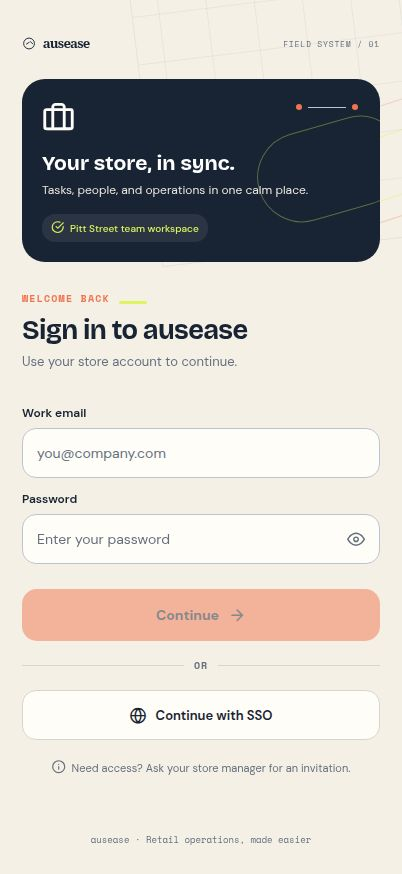
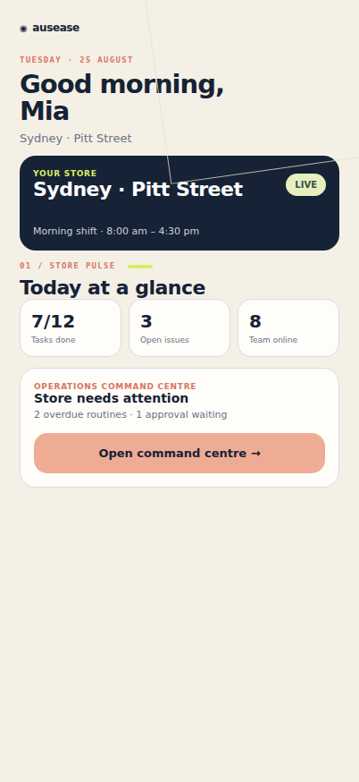
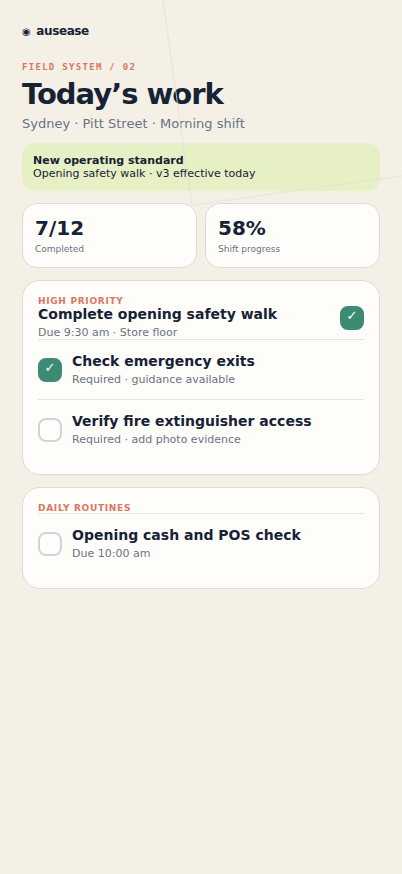
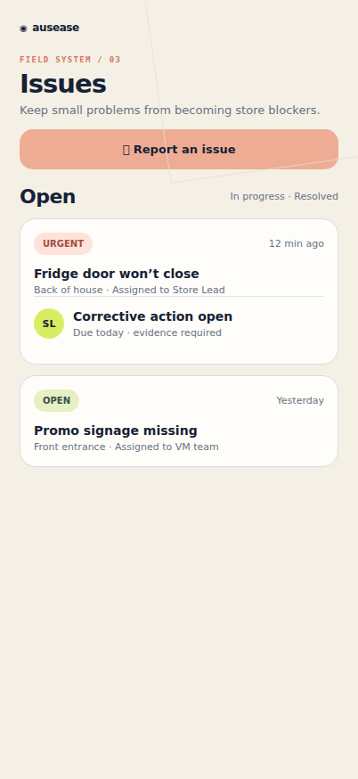
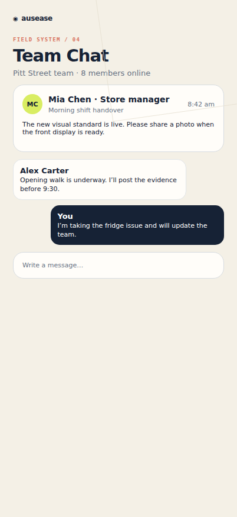
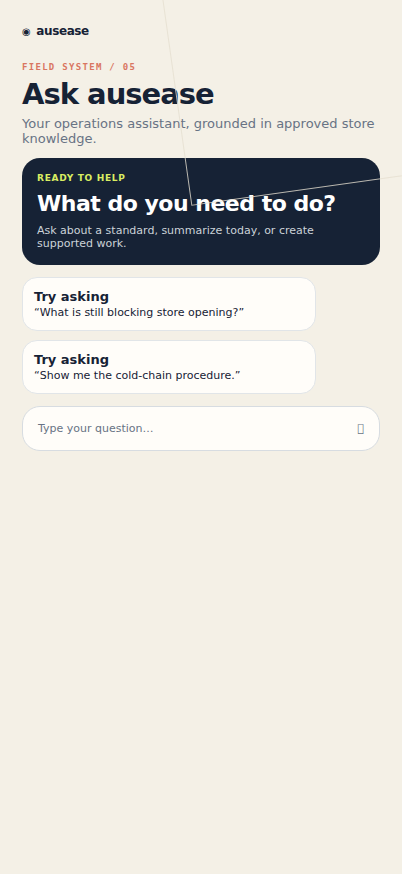
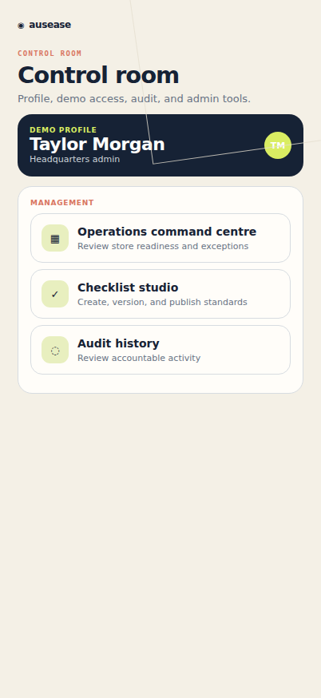
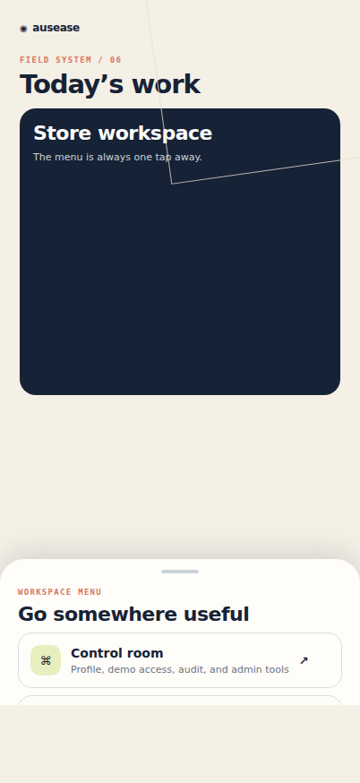
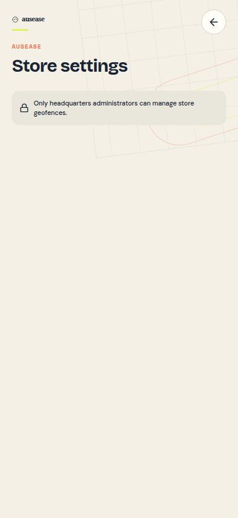

# ausease — Retail Operations Platform

## Complete Product, Feature, Workflow, and Technical Blueprint

**Audience:** Product, design, mobile, web, backend, data, QA, security, implementation, customer success, and retail operations teams  
**Document date:** 30 August 2026  
**Document status:** Product and engineering blueprint  
**Product:** ausease  
**Primary category:** Retail operations and frontline execution platform  
**Primary platforms:** iOS, Android, responsive web administration, authenticated API, data and integration platform

---

## 1. How to Use This Document

This document describes the target ausease platform that the product and technology teams should build toward. It combines:

- A market-informed product strategy.
- A complete target feature list.
- Detailed user and system workflows.
- Functional and non-functional requirements.
- Role and permission rules.
- Target data, API, event, and integration architecture.
- Security, privacy, audit, and governance requirements.
- A phased implementation roadmap.
- Acceptance criteria that can be converted into epics, stories, and tests.

This is not a claim that every feature is already implemented.

Every capability is labelled using one of these target states:

| State | Meaning |
|---|---|
| **Foundation exists** | A working foundation already exists in the current ausease product. It may still need production hardening or broader coverage. |
| **Extend** | A related capability exists, but the target product requires material expansion. |
| **Build** | The capability belongs in the target platform but is not part of the current complete workflow. |
| **Later** | Valuable capability that should follow the core platform and customer validation. |

The implementation team should convert each module into:

1. Product epic.
2. User stories by role.
3. API and data changes.
4. Mobile and web states.
5. Authorization and audit requirements.
6. Analytics events.
7. Test plan.
8. Release and migration plan.

---

## 2. Executive Product Definition

### 2.1 Product vision

ausease should become the operating system for multi-location retail: one trusted place where headquarters publishes intent, store teams execute it, managers coach and correct it, and leaders understand whether standards improve customer and commercial outcomes.

### 2.2 Positioning

For multi-store retailers that struggle to turn head-office plans into consistent store execution, ausease is a mobile-first retail operations platform that converts standards, communications, tasks, learning, audits, and exceptions into prioritized daily work with verifiable outcomes.

Unlike fragmented combinations of email, messaging apps, spreadsheets, generic task tools, learning systems, and paper audits, ausease should:

- Give each person one prioritized operational feed.
- Preserve the exact standard and version used for every completed activity.
- Link communication, knowledge, training, work, evidence, exceptions, and corrective action.
- Work reliably during weak or unavailable connectivity.
- Protect every operation by organization, region, store, role, and policy.
- Explain why work is assigned, what “good” looks like, and what happens next.
- Turn execution data into useful recommendations instead of passive dashboards.

### 2.3 Best-fit customers

The initial target customer profile is:

- Retailers with approximately 20 to 2,000 locations.
- Central operations, field leadership, and store-based teams.
- Recurring opening, closing, safety, service, merchandising, promotion, loss-prevention, and compliance work.
- Existing dependence on spreadsheets, email, WhatsApp/Teams groups, shared drives, paper checklists, or several disconnected frontline tools.
- A need for store-level accountability without burdening frontline employees.
- A desire to deploy quickly before undertaking large workforce-management or ERP replacement projects.

The platform should remain architecturally capable of supporting:

- Franchise networks.
- QSR and hospitality operations.
- Pharmacy and regulated specialty retail.
- Grocery and convenience retail.
- Field merchandising and brand execution.
- Warehouses and dark stores.

### 2.4 Product principles

1. **One frontline workday, not many modules.** Employees should see what matters now rather than navigate an enterprise software menu.
2. **Standards become executable work.** An SOP is useful only when the correct person receives the correct version at the correct moment.
3. **Proof must be proportionate.** Require evidence only where risk or value justifies the effort.
4. **Exceptions are more important than averages.** Managers need to know where intervention is required.
5. **History is immutable.** Completed work must retain its original standard, assignment, responses, evidence, and approvals.
6. **Offline is a normal state.** Store basements, stockrooms, and shopping centres regularly have poor connectivity.
7. **Security follows every request.** Identity, active membership, tenant, store, role, data classification, and action policy are server-enforced.
8. **AI assists; accountable people decide.** High-impact actions require clear context, preview, confirmation, and auditability.
9. **Configuration should not become custom software.** Retailers need flexible templates and rules without unmaintainable per-customer forks.
10. **Measure operational outcomes.** Completion alone is insufficient; the product should connect execution quality to exceptions, sales, waste, safety, and customer experience where data is available.

---

## 3. Market Landscape and Product Lessons

### 3.1 Market categories

Retail operations products increasingly overlap, but most began in one of six categories:

1. **Store execution and task management**
   - Recurring tasks, campaigns, checklists, evidence, audits, and dashboards.
2. **Frontline communication**
   - Targeted announcements, messaging, read tracking, and knowledge distribution.
3. **Frontline learning**
   - Microlearning, product knowledge, assessments, certifications, and coaching.
4. **Workforce management**
   - Scheduling, shift swaps, availability, time and attendance, and labour optimisation.
5. **Inspection, safety, and quality**
   - Form builders, inspections, issues, corrective actions, and compliance analytics.
6. **Retail intelligence and field execution**
   - Visual merchandising, promotion execution, store visits, image analysis, and commercial performance.

The strategic risk is building six disconnected modules inside one brand. ausease should instead use a shared work graph in which a communication can generate training, training can gate a task, a failed task can create an issue, an issue can create corrective action, and every outcome can be analysed together.

### 3.2 Representative competitor benchmark

This benchmark is a product-direction snapshot based on publicly available product information. Enterprise packaging and exact functionality may vary by customer and contract.

| Platform | Public positioning and strengths | Product lesson for ausease |
|---|---|---|
| **YOOBIC** | Unifies retail task management, communications, and frontline learning; emphasises AI, real-time HQ visibility, merchandising, and store performance. | Tasking, communication, and learning should share one experience and dataset. AI should prioritize action, not merely provide chat. |
| **WorkJam** | Broad frontline operations platform spanning communication, tasks, training, staffing, scheduling, workforce self-service, forms, audits, and integrations. | Enterprise buyers value consolidation and workforce integrations. ausease should integrate with systems of record before attempting to replace all of them. |
| **Zipline** | Retail communication and execution focus, including targeted communication, tasks, store audits/assessments, and a frontline-friendly retail experience. | Communication should be actionable, targeted, measurable, and connected to execution. Frontline usability is a core competitive dimension. |
| **Wooqer** | Mobile-first workflows, digital checklists, photo-based visual-merchandising audits, store visits, dashboards, and adaptable WorkApps. | Strong template flexibility and evidence-based execution are necessary, especially for multi-store and emerging-market customers. |
| **SafetyCulture** | Strong inspections, templates, issues, actions, training, and operational visibility across industries, including retail. | ausease needs an excellent no-code inspection and audit builder, while retaining deeper retail-specific workflows and store hierarchy. |
| **Opterus OPSCENTER** | Retail-specific communication, read compliance, task management, chat/newsfeeds, document library, tickets/help centre, and API-first integration. | Document control, read acknowledgement, tickets, multilingual support, and an open integration layer are enterprise requirements. |
| **Pazo** | Retail checklists, tasking, photo proof, communication, automated audits, compliance alerts, dashboards, geo/time/identity verification, and visual merchandising. | Fast deployment, proof of execution, and adaptable workflows are important for mid-market and India/APAC buyers. |
| **Jolt** | Operational checklists, forms, scheduling, information sharing, and accountability, with strength in food service and location-based operations. | Simple recurring operations can win adoption; ausease must avoid making routine store work feel like enterprise administration. |
| **Zebra Workcloud / Reflexis** | Enterprise store execution and workforce-management heritage, with tasking, scheduling, labour and operational coordination. | Large customers require workforce, POS, ERP, identity, and device integration at scale. ausease should be integration-ready from the start. |

### 3.3 Common market strengths that are table stakes

ausease should treat the following as expected platform capabilities:

- Mobile-first task completion.
- Repeating checklists and routines.
- Store, region, role, and group targeting.
- Photo and file evidence.
- Audits and store visits.
- Issue and corrective-action management.
- Real-time or near-real-time completion dashboards.
- Targeted communications with read tracking.
- Searchable document and SOP library.
- Role-based access.
- Multiple languages.
- Offline or low-connectivity support.
- Enterprise SSO and user provisioning.
- Export, APIs, and core integrations.
- Configurable forms and workflows.
- Notifications and escalations.
- Reporting by store, region, programme, and period.

### 3.4 Common market weaknesses and avoidable product traps

Public reviews and market positioning indicate recurring risks across the category:

- Too many disconnected modules and navigation paths.
- Frontline feeds that do not clearly prioritize urgent work.
- Weak search across messages, documents, tasks, and training.
- Difficult configuration that requires vendor professional services.
- Dashboards that show completion but not business impact.
- Excessive notifications that teach users to ignore the platform.
- Evidence collection that becomes surveillance or busywork.
- Inconsistent offline behaviour.
- Slow deployments caused by integrations and customer-specific customisation.
- Weak version control for procedures and checklists.
- Limited transparency into why a user received a task.
- Custom pricing and module packaging that make expansion difficult to plan.
- AI features that summarise data without safely completing operational work.

### 3.5 ausease market opportunity

ausease should differentiate around six promises:

1. **The clearest frontline workday:** one feed, precise priorities, minimal taps, and offline reliability.
2. **Standards with provenance:** every completion is attached to an immutable version, assignment, effective date, and audience.
3. **Closed-loop operations:** communication → acknowledgement → learning → task → evidence → exception → action → verification.
4. **Manager attention engine:** rank the small number of interventions that will improve execution, not every available metric.
5. **Safe operational AI:** grounded in approved content and live permissions, with human confirmation for consequential changes.
6. **Open retail data layer:** predictable APIs, events, exports, and integrations with identity, HR, scheduling, POS, ERP, BI, and service systems.

---

## 4. Users, Roles, and Scope

### 4.1 Retail hierarchy

The target hierarchy must support:

- Enterprise / customer account.
- Brand or business unit.
- Country.
- Region.
- District / area.
- Store cluster or format.
- Store.
- Department or zone.
- Team.
- Individual user.

Hierarchy depth should be configurable without changing authorization code. Every operational object should have:

- Owning organization.
- Applicable organizational unit.
- Applicable locations.
- Applicable roles or user groups.
- Visibility dates.
- Data classification.

### 4.2 Core personas

#### Store associate

Needs:

- A fast view of today’s priorities.
- Clear instructions and examples.
- Work that matches the current store, shift, and role.
- Reliable completion in low connectivity.
- Simple issue reporting.
- Help without searching several systems.

#### Store manager

Needs:

- Shift readiness and coverage.
- Delegation and reassignment.
- Live exceptions and blocked work.
- Evidence and quality review.
- Handover between shifts.
- Coaching and team recognition.
- A concise store operating summary.

#### Area or regional manager

Needs:

- Comparable store performance.
- Risk-ranked store visits.
- Trends, repeat failures, and overdue actions.
- Remote review of evidence.
- Store visit planning and reports.
- Escalation control.

#### Headquarters operations owner

Needs:

- Campaign and standard creation.
- Controlled publishing.
- Audience targeting.
- Rollout monitoring.
- Exception analysis.
- Cross-store benchmarking.
- Content ownership and lifecycle.

#### Visual merchandising or marketing owner

Needs:

- Campaign packs and planogram guidance.
- Store-specific rollout tasks.
- Before/after evidence.
- Image-assisted compliance.
- Launch readiness reporting.

#### Learning and development owner

Needs:

- Role-based learning paths.
- Microlearning attached to work.
- Assessments and certifications.
- Skills and compliance visibility.

#### Loss prevention, safety, or compliance reviewer

Needs:

- Inspections and risk scoring.
- Independent review.
- Evidence integrity.
- Corrective action and verification.
- Complete audit history.

#### IT and identity administrator

Needs:

- SSO and lifecycle automation.
- Role mapping.
- Device and session controls.
- API credentials and integration monitoring.
- Security and audit exports.

#### Executive or read-only stakeholder

Needs:

- Trusted aggregated performance.
- Drill-down without accidental mutation.
- Trend and business-outcome views.

### 4.3 Target permission model

Use role-based access plus scoped attributes.

**Role controls** determine what action may be performed.  
**Attributes** determine where and on what data it may be performed.

Required attributes include:

- Organization.
- Business unit.
- Region/district.
- Store or store group.
- Department.
- Employment status.
- Role and job family.
- Data classification.
- Temporary delegation.
- Effective start and end dates.

No mobile client decision is authoritative. The API must independently evaluate the permission for every protected request.

---

## 5. Target Product Information Architecture

### 5.1 Frontline mobile navigation

The mobile application should have five primary destinations:

1. **Today**
   - Prioritized work, shift readiness, announcements, learning, and alerts.
2. **Work**
   - Tasks, routines, checklists, campaigns, inspections, and assigned actions.
3. **Issues**
   - Reported issues, tickets, corrective actions, and status.
4. **Team**
   - Store communication, targeted channels, handover, recognition, and directory.
5. **Ask ausease**
   - Search, knowledge assistant, summaries, and supported operations.

A bottom-sheet menu should contain lower-frequency destinations:

- Knowledge.
- Learning.
- Schedule link or workforce integration.
- Store settings.
- Downloads and offline queue.
- Profile and accessibility.
- Help and support.

### 5.2 Manager experience

Managers should start with:

- Shift readiness.
- Who is present.
- Critical overdue work.
- Unassigned work.
- Failed checks.
- Evidence awaiting review.
- Open customer-impacting issues.
- Handover notes.
- One-tap actions to assign, escalate, approve, or request correction.

### 5.3 Headquarters web experience

The web administration experience should include:

- Operations command centre.
- Programme and campaign management.
- Checklist, form, and workflow studio.
- Communication centre.
- Knowledge and document control.
- Learning studio.
- Store and organizational hierarchy.
- People, roles, and groups.
- Audit and compliance.
- Analytics and data exports.
- Integration centre.
- Platform configuration.

---

## 6. Module A — Identity, Tenant, Organization, and Access

**Target state:** Foundation exists; extend for enterprise administration.

### 6.1 Functional requirements

- Email/password and passwordless options where supported.
- Enterprise SAML and OIDC SSO.
- Optional social identity only where customer policy allows.
- Multi-factor authentication policy support.
- SCIM or HR-driven user provisioning and deprovisioning.
- Just-in-time membership creation only for approved domains and mappings.
- Multiple organization memberships for authorised contractors or shared services.
- User status: invited, active, suspended, disabled, departed.
- Effective-dated store and role assignments.
- Temporary acting-manager and cross-store assignments.
- Session and device management.
- Read-only and auditor roles.
- Service accounts for integrations.
- API key and OAuth client lifecycle.

### 6.2 Access workflow

1. User authenticates through the configured identity provider.
2. The API verifies the identity token.
3. ausease resolves active membership and effective assignments.
4. If exactly one workspace is available, it is selected.
5. If several are available, the user chooses an authorized workspace.
6. The API returns capability flags, organizational scope, and policy requirements.
7. The client renders only permitted actions.
8. Every API request repeats server-side authorization.

### 6.3 Edge and failure states

- Authenticated but not provisioned.
- Invitation email differs from identity-provider email.
- Duplicate invitation across tenants.
- Membership expired during a session.
- Store assignment changes while offline.
- User has regional read access but store-level write access.
- SSO provider unavailable.
- Identity valid but required profile attributes missing.

### 6.4 Acceptance criteria

- Cross-tenant identifiers never grant or reveal access.
- Disabled membership blocks new mutations immediately.
- Effective-dated assignments activate and expire without data migration.
- All administrative membership changes create audit events.
- Users receive actionable access messages rather than generic errors.

---

## 7. Module B — Today Feed and Shift Operating View

**Target state:** Extend.

### 7.1 Purpose

Today is the daily operating surface. It must answer:

- What must I do now?
- What is late or blocked?
- What changed since my last shift?
- What do I need to know before serving customers?
- Where do I need help?

### 7.2 Feed inputs

- Shift and store context.
- Required opening or closing routines.
- Assigned tasks.
- Active campaigns.
- Due checklists and inspections.
- Required acknowledgements.
- Mandatory microlearning.
- Open actions owned by the user.
- Unread high-priority communication.
- Store or safety alerts.
- Offline and synchronization status.

### 7.3 Prioritization rules

Rank by:

1. Safety and critical compliance.
2. Customer-impacting incident.
3. Due now or overdue.
4. Store-opening dependency.
5. Promotion or launch deadline.
6. Manager-assigned priority.
7. Normal recurring work.
8. Optional learning or recognition.

The system must explain priority, for example:

- “Required before store opening.”
- “Overdue by 18 minutes.”
- “Blocks the Spring Launch checklist.”
- “Assigned by Priya.”
- “Updated operating standard—acknowledgement required.”

### 7.4 Shift workflow

1. User opens ausease.
2. App resolves store, role, local time, and shift.
3. Critical content is refreshed.
4. Cached work remains available if offline.
5. User reviews changed standards or priority announcements.
6. User begins required readiness work.
7. Completion updates the store readiness view.
8. Blockers appear to the manager.
9. End-of-shift handover captures unresolved work.

### 7.5 Acceptance criteria

- First useful content appears quickly on normal mobile networks.
- Offline users can see previously synchronized assigned work.
- Duplicate items from different modules are consolidated where appropriate.
- Read-only users cannot reveal mutation controls.
- Managers can see why a store is not ready without opening every task.

---

## 8. Module C — Tasks, Routines, and Workflow Automation

**Target state:** Foundation exists; extend.

### 8.1 Task types

- One-time task.
- Recurring routine.
- Campaign task.
- Checklist-linked task.
- Event-triggered task.
- Corrective action.
- Approval task.
- Learning-linked task.
- System-generated exception task.
- External-system task.

### 8.2 Task definition

Each task may contain:

- Title and description.
- Operational category.
- Priority and severity.
- Owner and accountable manager.
- Location and department scope.
- Assignee rule.
- Start, due, and expiry time.
- Time-zone policy.
- Estimated duration.
- Dependencies.
- Required checklist or form.
- Required evidence.
- Required approver.
- Escalation policy.
- Completion conditions.
- Tags and external references.

### 8.3 Assignment rules

Support assignment to:

- Named user.
- Role on shift.
- Store manager.
- Department lead.
- Store team.
- Region or store group.
- Dynamic audience defined by attributes.
- First eligible claimant.

Assignment must never silently guess a person when accountability is ambiguous.

### 8.4 Recurrence

- Daily, weekly, monthly.
- Selected days.
- Store-calendar aware.
- Relative to opening, closing, delivery, promotion, or shift.
- Holiday and exception calendar.
- “Complete once per store” versus “complete once per assignee.”
- Grace periods and rollover rules.

### 8.5 Task lifecycle

Draft → Scheduled → Available → In progress → Submitted → Under review → Completed.

Alternative states:

- Blocked.
- Failed.
- Needs correction.
- Cancelled.
- Expired.
- Skipped with authorised reason.

### 8.6 Completion workflow

1. API confirms current assignment and policy.
2. User opens task and receives exact instructions.
3. Dependencies and required acknowledgements are evaluated.
4. User enters responses and evidence.
5. Work autosaves locally and remotely when possible.
6. Validation identifies missing required content.
7. User submits.
8. If approval is required, status becomes Under review.
9. Approver accepts or requests correction.
10. Final completion and timing metrics are recorded.
11. Downstream tasks and events are triggered.

### 8.7 Failure workflow

1. User cannot complete a task.
2. User chooses Blocked, Failed, or Need help.
3. Reason and optional evidence are captured.
4. The manager is notified according to severity.
5. A ticket or corrective action may be created automatically.
6. The original task remains linked to the resolution.

---

## 9. Module D — Checklist, Form, Inspection, and Audit Studio

**Target state:** Foundation exists; substantially extend.

### 9.1 Builder requirements

The no-code builder should support:

- Sections and pages.
- Instruction blocks.
- Single and multiple choice.
- Yes/no/not applicable.
- Number, currency, percentage, and calculated values.
- Short and long text.
- Date and time.
- Barcode and QR scan.
- Signature.
- Photo, video, document, and audio evidence.
- Annotation on image.
- Location and device metadata where lawful.
- Product, SKU, asset, and store references.
- Repeating groups.
- Conditional logic.
- Branching.
- Validation.
- Weighted scores.
- Critical-fail questions.
- Required comments for failed responses.
- Translations.
- Reference images and “what good looks like.”

### 9.2 Template lifecycle

Draft → In review → Approved → Scheduled → Published → Superseded → Archived.

Rules:

- Published versions are immutable.
- A new version is cloned from a prior version.
- Completed records remain attached to the exact original version.
- Effective dates determine frontline availability.
- Emergency withdrawal is allowed but never deletes history.
- Owners and reviewers must be explicit.
- Publication can require dual approval for regulated programmes.

### 9.3 Assignment model

Target using:

- Store.
- Store group.
- Region.
- Format.
- Role.
- Department.
- Individual.
- Campaign.
- Product category.
- Risk segment.

### 9.4 Checklist execution

- Step-level progress persists across devices.
- Work date and time zone are explicit.
- Autosave survives app closure.
- Optional collaboration permits several contributors with an accountable submitter.
- N/A requires a configured reason.
- Critical failure can stop submission and trigger escalation.
- Evidence requirements can depend on answers.
- Reviewers can compare submitted evidence with reference evidence.

### 9.5 Audit programme

An audit programme should define:

- Audit type.
- Store population.
- Sampling policy.
- Auditor eligibility and independence.
- Frequency.
- Announcement policy.
- Scoring model.
- Critical controls.
- Corrective-action SLA.
- Re-audit policy.
- Reporting calendar.

### 9.6 Store visit workflow

1. Regional manager plans a visit based on risk or schedule.
2. The system assembles store context and unresolved issues.
3. Visitor checks in.
4. Visit checklist is completed with notes and evidence.
5. Store manager may acknowledge findings.
6. Failures create corrective actions.
7. Visit report is generated.
8. Follow-up and re-verification dates are scheduled.

---

## 10. Module E — Campaign and Retail Change Execution

**Target state:** Build.

### 10.1 Supported programmes

- New product launch.
- Promotion and markdown.
- Visual-merchandising rollout.
- Seasonal change.
- Planogram reset.
- Store opening or refurbishment.
- Recall or urgent product withdrawal.
- Price or label change.
- Policy rollout.

### 10.2 Campaign pack

- Objective and commercial context.
- Audience and store segmentation.
- Launch calendar.
- Embargo and visibility dates.
- Assets and reference imagery.
- Tasks and dependencies.
- Required learning.
- Product/SKU list.
- Communication plan.
- Evidence and approval rules.
- Success measures.
- Rollback or cancellation plan.

### 10.3 Launch readiness workflow

1. HQ creates campaign.
2. Store eligibility is calculated.
3. Content, learning, and tasks are scheduled.
4. Managers review expected labour and dependencies.
5. Teams complete preparation.
6. Readiness is calculated by store.
7. At-risk stores are escalated before launch.
8. Launch evidence is submitted.
9. HQ reviews exceptions and commercial signals.
10. Campaign closes with lessons and reusable assets.

### 10.4 Acceptance criteria

- A campaign has one status across communications, tasks, learning, and evidence.
- Store readiness is explainable.
- Late content changes create a new controlled revision.
- Stores excluded by format or stock do not receive irrelevant work.

---

## 11. Module F — Communication, Acknowledgement, and Handover

**Target state:** Extend.

### 11.1 Communication types

- Urgent alert.
- Required acknowledgement.
- Operational announcement.
- Campaign update.
- Store message.
- Team chat.
- Shift handover.
- Recognition.
- Survey or pulse.
- System notification.

### 11.2 Targeting

- Organization, brand, country, region, store, group, role, department, shift, or named users.
- Effective and expiry times.
- Local-time delivery windows.
- Language targeting.
- Exclusions.

### 11.3 Read and acknowledgement compliance

Track:

- Delivered.
- Opened.
- Read.
- Acknowledged.
- Action completed.
- Declined or unable with reason.

Reading a message is not equivalent to completing its required action.

### 11.4 Shift handover

1. Outgoing manager opens Handover.
2. System pre-populates incomplete critical work and open incidents.
3. Manager adds notes, ownership, and attachments.
4. Incoming manager reviews and acknowledges.
5. Unresolved items remain active.
6. Handover is retained as an auditable record.

### 11.5 Notification policy

- In-app inbox is the source of truth.
- Push notifications are reserved for timely, relevant changes.
- Email and SMS are policy-controlled fallbacks.
- Quiet hours and local-time policies apply.
- Escalations should consolidate related items.
- Users can control non-critical channels, not mandatory compliance delivery.

---

## 12. Module G — Knowledge, SOP, and Document Control

**Target state:** Build.

### 12.1 Content types

- SOP.
- Policy.
- Product guide.
- Safety guidance.
- Campaign pack.
- Quick reference.
- FAQ.
- Video.
- Troubleshooting article.
- External link.

### 12.2 Document control

- Owner and approver.
- Version.
- Effective and review dates.
- Draft/review/published/archive lifecycle.
- Audience.
- Translations.
- Superseded warning.
- Required acknowledgement.
- Related checklists, tasks, and learning.
- Download and offline policy.
- Confidentiality classification.

### 12.3 Search

Search across:

- Titles and body.
- Attached document text.
- Tags.
- Product and SKU.
- Store format.
- Tasks, communications, and learning references.

Results must respect current permissions before retrieval and before AI generation.

### 12.4 Knowledge workflow

1. Owner creates or imports content.
2. Reviewer approves.
3. Version is published to an audience.
4. Required acknowledgements or learning are assigned.
5. Search and AI use the new approved version after its effective date.
6. A later version supersedes it.
7. Historical work retains the prior reference.

---

## 13. Module H — Learning, Skills, and Coaching

**Target state:** Build after core execution.

### 13.1 Learning capabilities

- Microlearning.
- Courses and learning paths.
- Video, document, and interactive content.
- Quizzes and assessments.
- Certifications and expiry.
- Role-based mandatory learning.
- Product and campaign learning.
- Manager observation and sign-off.
- Refresher rules.
- Skills matrix.
- Training in the flow of work.

### 13.2 Work-linked learning

- A task may require learning before execution.
- A failed audit item may assign targeted refresher content.
- Repeated exceptions may recommend coaching.
- A new product campaign may combine briefing, quiz, and execution task.
- Managers can see capability gaps without accessing inappropriate personal data.

### 13.3 Coaching workflow

1. System or manager identifies a gap.
2. Manager selects evidence and expected behaviour.
3. Coaching conversation is recorded.
4. Learning or observed practice is assigned.
5. Employee completes the action.
6. Manager verifies improvement.
7. Coaching closes or continues.

---

## 14. Module I — Issues, Incidents, Tickets, and Corrective Action

**Target state:** Foundation exists; extend.

### 14.1 Issue categories

- Customer.
- Product or inventory.
- Pricing.
- Equipment or facility.
- Safety.
- Security or loss prevention.
- Staffing.
- Technology.
- Visual merchandising.
- Delivery.
- Compliance.

### 14.2 Issue record

- Category and severity.
- Description.
- Reporter.
- Store and location within store.
- Date/time.
- Evidence.
- Customer impact.
- Immediate containment.
- Owner and SLA.
- Linked task, checklist response, asset, product, or campaign.
- Status and resolution.
- Root cause.

### 14.3 Lifecycle

Reported → Triaged → Assigned → In progress → Awaiting external support → Resolved → Verified → Closed.

Alternative:

- Duplicate.
- Rejected with reason.
- Reopened.

### 14.4 Corrective and preventive action

- Immediate correction.
- Root-cause analysis.
- Corrective action.
- Preventive action.
- Owner.
- Due date.
- Evidence.
- Reviewer.
- Effectiveness check.
- Re-audit.

### 14.5 Escalation workflow

1. Issue is created manually or from a failed control.
2. Severity and SLA are calculated.
3. Critical issues notify defined responders.
4. Manager confirms containment.
5. Owner performs resolution.
6. Evidence is reviewed.
7. Independent verification occurs where required.
8. Repeat-pattern detection may open a broader investigation.

---

## 15. Module J — Evidence and Media

**Target state:** Foundation exists; extend.

### 15.1 Evidence types

- Photo.
- Video.
- Document.
- Signature.
- Barcode/QR scan.
- Sensor or system reading.
- Text response.
- Manager observation.

### 15.2 Evidence integrity

Store:

- Uploader.
- Organization and store.
- Capture and upload time.
- Linked work item and version.
- File hash.
- MIME type and size.
- Device metadata where permitted.
- Location metadata where required and lawful.
- Annotation history.
- Review status.
- Retention class.

### 15.3 Media workflow

1. Client checks policy and permission.
2. Media is captured or selected.
3. Client validates size and format.
4. Offline-safe local copy is created if needed.
5. API issues a short-lived upload authorization.
6. Object is uploaded.
7. API verifies and registers metadata.
8. Evidence is linked to the work item.
9. Malware/content checks run where applicable.
10. Authorized viewers use short-lived access.

### 15.4 AI-assisted image review

Later capabilities may include:

- Planogram comparison.
- Display and signage presence.
- Shelf-gap and out-of-stock indicators.
- Cleanliness or obstruction flags.
- OCR for labels and prices.
- Duplicate or reused evidence detection.

AI results must be treated as recommendations with confidence and reviewer override, not unquestionable compliance decisions.

---

## 16. Module K — Store Presence, Location, and Device Context

**Target state:** Foundation exists; extend carefully.

### 16.1 Presence options

- Device geofence.
- QR code at location.
- Manager confirmation.
- Network or device-management signal.
- Shift system confirmation.
- No presence requirement.

### 16.2 Policy principles

- Presence checks are purpose-limited and transparent.
- Continuous employee location tracking is not required for normal operations.
- Exact location is retained only where lawful and necessary.
- Users receive clear permission recovery guidance.
- HQ can pause enforcement without deleting configuration.
- Manual override requires reason and audit.

### 16.3 Check-in workflow

1. User requests check-in.
2. App explains why location or other verification is needed.
3. Permission and device capability are checked.
4. API validates store, radius, accuracy, and policy.
5. Time-limited presence is created.
6. Controlled work becomes available.
7. Expiry or leaving policy is applied.

---

## 17. Module L — Manager Command Centre

**Target state:** Foundation exists; extend.

### 17.1 Manager questions

The command centre should answer:

- Is the store ready?
- What is late?
- What failed?
- Who needs support?
- What is waiting for my review?
- Which customer or safety risks require action?
- What will miss SLA if I do nothing?

### 17.2 Core views

- Shift readiness.
- Work status by priority.
- Team assignment and presence.
- Failed critical controls.
- Evidence review queue.
- Open issues and actions.
- Campaign readiness.
- Acknowledgement and learning compliance.
- Handover.

### 17.3 Attention engine

Each recommended intervention should include:

- What happened.
- Why it matters.
- Affected store/customer/process.
- Due or SLA status.
- Suggested next action.
- Confidence/source.

### 17.4 History

Managers should review checklist completion history by:

- Store.
- Date.
- User.
- Template.
- Exact version.
- Completion state.
- Score.
- Failed item.
- Evidence and reviewer.

---

## 18. Module M — Regional and Headquarters Operations

**Target state:** Extend.

### 18.1 Portfolio views

- Store readiness map/list.
- Completion and quality heatmap.
- Risk-ranked stores.
- Campaign rollout.
- Audit programme.
- Repeated failed controls.
- Overdue corrective actions.
- Communication reach.
- Learning and certification.
- Operational trends.

### 18.2 Comparison rules

Avoid unfair league tables. Comparisons should account for:

- Store format.
- Trading hours.
- Store size.
- Region.
- Programme eligibility.
- Data completeness.
- Newly opened locations.

### 18.3 Operational review workflow

1. Leader selects period and scope.
2. System shows outcomes, exceptions, and data quality.
3. Leader drills into stores or programmes.
4. Repeated root causes are identified.
5. Action plans are assigned.
6. Progress is reviewed in the next operating cadence.

---

## 19. Module N — Analytics, Reporting, and Outcome Measurement

**Target state:** Build on the operational data foundation.

### 19.1 Metric layers

#### Adoption

- Active users.
- Store activation.
- Feed opens.
- Work started.
- Communication reach.

#### Execution

- On-time completion.
- Completion cycle time.
- First-pass acceptance.
- Rework rate.
- Evidence compliance.
- Checklist score.
- Campaign readiness.

#### Exception

- Critical failures.
- Overdue issues and actions.
- Repeat failures.
- Mean time to acknowledge.
- Mean time to resolve.

#### Capability

- Learning completion.
- Assessment score.
- Certification coverage.
- Skill gap.

#### Business outcome

Where integrated:

- Sales or conversion change.
- Promotion uplift.
- Stock availability.
- Waste.
- Shrink.
- Customer satisfaction.
- Safety incident rate.
- Labour hours recovered.

### 19.2 Reporting requirements

- Saved views.
- Scheduled reports.
- CSV/XLSX export.
- PDF executive summary.
- BI connector or warehouse export.
- Metric definitions and lineage.
- Time-zone aware reporting.
- Data completeness indicator.
- Drill-down from aggregate to authorized source record.

### 19.3 Causality guardrail

The platform should distinguish:

- Correlation.
- Before/after comparison.
- Controlled comparison.
- Attributed operational benefit.

Do not claim that task completion caused sales growth without sufficient evidence.

---

## 20. Module O — ausease AI and Intelligent Operations

**Target state:** Foundation exists; extend with controlled tools.

### 20.1 AI use cases

- Answer questions from approved SOPs and current standards.
- Summarise today’s store priorities.
- Summarise issues and handover.
- Find relevant procedures.
- Draft a task, checklist, communication, or corrective action.
- Convert an instruction into a structured draft workflow.
- Translate and simplify content.
- Classify and route issues.
- Recommend manager priorities.
- Detect repeated operational patterns.
- Analyse images with confidence and human review.

### 20.2 Grounding

AI may use:

- Authorized published knowledge.
- Authorized active checklist versions.
- User/store/role context.
- Operational records within current scope.
- Approved external data sources.

It must not retrieve or expose:

- Other-tenant data.
- Unauthorized stores.
- Archived confidential content.
- Secrets or credentials.
- Personal data outside the use case.

### 20.3 Action policy

#### No confirmation required

- Search.
- Summarise.
- Explain.
- Draft without saving.

#### Confirmation required

- Create task.
- Assign work.
- Send communication.
- Change due date.
- Open corrective action.
- Submit a completed operation.

#### Restricted or dual approval

- Publish standards.
- Bulk assignment.
- High-severity closure.
- Membership and access changes.
- Destructive or irreversible operations.

### 20.4 AI action workflow

1. User asks in natural language or voice.
2. Server resolves identity and allowed scope.
3. Assistant retrieves authorized context.
4. Intent is converted to a structured operation.
5. Missing owner, store, due date, or other critical field triggers clarification.
6. Assistant presents a preview.
7. User confirms.
8. Server independently validates policy.
9. Operation executes idempotently.
10. Result and audit reference are shown.

### 20.5 AI quality and safety

- Cite source documents and versions.
- Show uncertainty where appropriate.
- Never fabricate completion status.
- Treat retrieved content as data, not instructions.
- Log model, prompt policy version, tools, and outcome without storing unnecessary sensitive text.
- Provide human correction and feedback.
- Maintain regression tests for critical intents and tenant boundaries.

---

## 21. Module P — Integrations and Open Platform

**Target state:** Build incrementally.

### 21.1 Priority integrations

#### Identity and people

- Microsoft Entra ID.
- Okta.
- Google Workspace.
- HRIS and payroll.
- SCIM.

#### Workforce

- Scheduling.
- Time and attendance.
- Shift marketplace.
- Labour planning.

#### Retail systems

- POS.
- ERP.
- Inventory.
- Order management.
- Product information.
- Pricing and promotions.
- Planogram and merchandising systems.

#### Collaboration and service

- Microsoft Teams.
- Slack.
- Email and SMS.
- ServiceNow, Jira, or help desk.

#### Data

- Data warehouse.
- BI tools.
- Secure file transfer.
- Webhooks.

### 21.2 Integration centre

Administrators need:

- Connection status.
- Last successful sync.
- Records processed and rejected.
- Field mapping.
- Scope.
- Credential rotation status.
- Replay controls.
- Error details without secret exposure.
- Audit history.

### 21.3 API principles

- Versioned REST API initially.
- OpenAPI as source of truth.
- Idempotency keys on create and action endpoints.
- Cursor pagination.
- Stable error codes.
- Rate limits.
- Correlation identifiers.
- OAuth or scoped service credentials.
- Webhooks with signatures and replay protection.
- Bulk export for analytical use rather than excessive transactional pagination.

---

## 22. Detailed End-to-End Workflows

### Workflow 1 — Open a store

1. Manager and team authenticate.
2. Current store and shift are resolved.
3. Presence policy is evaluated.
4. Opening routine appears at the top of Today.
5. Dependencies are assigned to eligible staff.
6. Team completes safety, cash, equipment, cleanliness, stock, and readiness checks.
7. Failed critical controls create immediate issues.
8. Manager reviews exceptions.
9. Store readiness becomes Ready, Ready with exceptions, or Not ready.
10. Regional view updates.

### Workflow 2 — Publish a new operating standard

1. Content owner clones the current standard.
2. Changes are made in draft.
3. Reviewers compare versions.
4. Required approvals are recorded.
5. Stores and roles are targeted.
6. Effective date and acknowledgement policy are set.
7. Publication is scheduled.
8. At the effective time, the new version becomes current.
9. Assigned users receive targeted communication.
10. New work uses the new version.
11. Historical work remains attached to the old version.

### Workflow 3 — Execute a merchandising campaign

1. HQ creates campaign and eligibility rules.
2. Campaign pack, learning, tasks, and reference images are attached.
3. Store managers review workload.
4. Teams complete preparation and display setup.
5. Evidence is submitted.
6. Automated and/or human review flags variance.
7. Corrections are requested.
8. Readiness and compliance roll up by store and region.
9. Sales or stock signals are added if integrated.
10. Campaign closes with performance and lessons.

### Workflow 4 — Complete work offline

1. Assigned work is synchronized before connectivity is lost.
2. User opens the cached exact version.
3. Responses and evidence save locally.
4. App displays offline and pending-sync status.
5. User submits locally.
6. Queue retries on connectivity or foreground.
7. Server validates current authorization and conflict rules.
8. Accepted changes receive server identifiers.
9. Rejected conflicts remain recoverable and explain what changed.
10. User is never shown false synchronized success.

### Workflow 5 — Fail a critical safety check

1. User records a critical failed response.
2. Form requires note and evidence.
3. Submission triggers incident and containment workflow.
4. Manager receives critical notification.
5. Store readiness reflects the failure.
6. Corrective action is assigned.
7. Evidence of resolution is submitted.
8. Authorized reviewer verifies.
9. Audit trail retains the failure and resolution.

### Workflow 6 — Report a store issue

1. User taps Report issue.
2. Category, severity, description, and evidence are captured.
3. Store and reporter context are attached.
4. Routing selects the responsible queue.
5. SLA starts.
6. Owner responds and updates progress.
7. Reporter and manager see status.
8. Resolution evidence is reviewed.
9. Issue closes or reopens.

### Workflow 7 — Communicate an urgent product recall

1. HQ creates critical alert.
2. Affected stores/SKUs are targeted from integrated data or explicit selection.
3. Alert includes acknowledgement and removal task.
4. Push and configured fallback channels deliver the alert.
5. Store manager acknowledges.
6. Team scans or confirms affected stock and adds evidence.
7. Non-responsive stores escalate.
8. HQ sees store-by-store containment.
9. Closure is retained for audit.

### Workflow 8 — Conduct a regional store visit

1. Regional manager sees risk-ranked stores.
2. Visit is scheduled.
3. System prepares recent failures, actions, campaigns, and trends.
4. Visitor checks in.
5. Audit and coaching observations are completed.
6. Store manager acknowledges findings.
7. Actions and owners are agreed.
8. Visit report is issued.
9. Follow-up verifies effectiveness.

### Workflow 9 — Onboard a new employee

1. HR or administrator provisions membership.
2. Role, store, and effective date are assigned.
3. User authenticates using customer identity policy.
4. Required policies and learning are assigned.
5. Guided app orientation is completed.
6. Role-specific supervised tasks are unlocked.
7. Manager signs off capability.
8. Normal work becomes available.

### Workflow 10 — Ask ausease to assign work

1. Manager asks, “Assign the freezer temperature recheck to the closing supervisor by 8 pm.”
2. AI resolves store and date.
3. If more than one eligible owner exists, it asks for clarification.
4. Structured task preview is shown.
5. Manager confirms.
6. API validates manager scope and assignee eligibility.
7. Task is created and notification delivered.
8. Audit records actor, request, confirmed operation, and result.

### Workflow 11 — Review performance

1. Manager selects store and period.
2. Dashboard shows data completeness and key outcomes.
3. Manager reviews late work, failures, rework, issues, and actions.
4. Trends are segmented by programme and area.
5. Source records and exact versions can be opened.
6. Coaching or corrective actions are assigned.
7. Review notes are retained.

### Workflow 12 — Offboard an employee

1. HR or administrator marks employment ended.
2. Active sessions and future write access are revoked.
3. Open work is reassigned.
4. Authored records remain attributed to the historical identity.
5. Personal data follows retention policy.
6. Audit captures the access change.

---

## 23. Offline, Synchronization, and Conflict Model

### 23.1 Offline-capable data

- Today feed.
- Assigned tasks and exact template versions.
- Published knowledge selected for offline use.
- Draft responses.
- Pending evidence.
- Issue drafts.
- Handover drafts.

### 23.2 Queue requirements

Each queued mutation should store:

- Tenant, store, and user namespace.
- Client-generated operation ID.
- Resource and action.
- Base server version.
- Payload.
- Local media references.
- Created time.
- Attempt count and last error class.

### 23.3 Conflict rules

- Checklist responses: merge only non-overlapping item updates where safe.
- Final submission: server authoritative; rejected conflict requires review.
- Task assignment: current server assignment wins unless manager reconfirms.
- Chat/message send: idempotent append.
- Evidence registration: deduplicate by operation ID and file hash.
- Published definitions: immutable, therefore never overwritten by offline clients.

### 23.4 User experience

Clearly distinguish:

- Saved on this device.
- Waiting to sync.
- Syncing.
- Synchronized.
- Needs attention.
- Rejected due to changed access.

---

## 24. Target Technical Architecture

### 24.1 Client applications

#### Mobile

- Expo / React Native.
- Expo Router.
- TypeScript.
- React Query for server state.
- Durable local storage and file queue.
- Camera, location, audio, notifications, and secure credential support.

#### Web administration

- Responsive React application.
- Shared design tokens and generated API client.
- Optimized for creation, bulk administration, dashboards, and review.

### 24.2 API and services

Initial architecture should remain a modular monolith unless scale or team boundaries justify extraction.

Logical modules:

- Identity and membership.
- Organization and hierarchy.
- Work and workflow.
- Templates and publishing.
- Communication.
- Knowledge.
- Learning.
- Issues and actions.
- Evidence.
- Analytics.
- AI orchestration.
- Integrations.
- Audit.
- Notifications.

### 24.3 Persistence

- PostgreSQL for transactional records.
- Object storage for evidence and content.
- Redis-compatible cache/queue when workload requires it.
- Search index for enterprise knowledge and cross-object search.
- Analytical warehouse or replicated store for large-scale BI.

### 24.4 Background processing

Use durable jobs for:

- Recurrence expansion.
- Notifications and escalations.
- Media processing.
- Exports.
- Search indexing.
- AI enrichment.
- Integration sync.
- Scheduled publication.
- Analytics aggregation.

Jobs must be:

- Idempotent.
- Observable.
- Retryable.
- Tenant-scoped.
- Dead-lettered after policy-defined failure.

### 24.5 Event model

Examples:

- membership.activated
- standard.published
- task.assigned
- task.submitted
- task.completed
- checklist.item_failed
- evidence.uploaded
- issue.reported
- corrective_action.overdue
- communication.acknowledged
- campaign.store_ready
- learning.certification_expiring

Events should include:

- Event ID.
- Type and schema version.
- Organization and store scope.
- Actor.
- Resource.
- Occurred time.
- Correlation and causation IDs.
- Safe metadata.

### 24.6 API contract practices

- OpenAPI contract first.
- Generated client and server validation.
- Backward-compatible additive change by default.
- Explicit deprecation.
- Contract tests.
- Stable domain error codes.
- No secret or internal credential fields in response models.

---

## 25. Core Domain Data Model

The target domain should include:

### Identity and organization

- Organization.
- OrganizationalUnit.
- Store.
- Department.
- UserIdentity.
- Membership.
- Role.
- Permission.
- Assignment.
- UserGroup.

### Standards and knowledge

- ContentItem.
- ContentVersion.
- Approval.
- Publication.
- Audience.
- Acknowledgement.
- Translation.

### Work

- WorkDefinition.
- WorkInstance.
- RecurrenceRule.
- Dependency.
- Assignee.
- Response.
- Submission.
- Review.

### Checklist and audit

- Template.
- TemplateVersion.
- Section.
- Item.
- ScoringRule.
- AuditProgramme.
- Visit.

### Communication and learning

- Channel.
- Message.
- Delivery.
- Course.
- Lesson.
- Assessment.
- Certification.
- Skill.

### Exception management

- Issue.
- Incident.
- CorrectiveAction.
- RootCause.
- Verification.
- SLA.
- Escalation.

### Evidence and audit

- Evidence.
- MediaObject.
- AuditEvent.
- ChangeRecord.
- RetentionPolicy.

### Campaign and analytics

- Campaign.
- CampaignStore.
- ReadinessSignal.
- MetricDefinition.
- MetricObservation.
- ExternalReference.

All customer-owned records must include an organization boundary. Store-scoped records must include both organization and store boundaries.

---

## 26. Security, Privacy, and Governance

### 26.1 Security controls

- Server-side tenant and role authorization.
- Least-privilege service credentials.
- Encryption in transit and at rest.
- Short-lived signed media access.
- Secret management outside source code.
- Rate limiting and abuse controls.
- Input and file validation.
- Malware scanning for uploaded documents where required.
- Dependency and static security scanning.
- Secure audit logging.
- Backup and restore testing.
- Incident response procedures.

### 26.2 Privacy

- Collect only data required for an operational purpose.
- Provide customer-configurable retention where legally possible.
- Support data access and deletion workflows.
- Avoid continuous location tracking.
- Separate employee performance indicators from unsupported automated employment decisions.
- Make AI and image analysis transparent.
- Define regional data residency strategy for enterprise customers.

### 26.3 Audit

Audit at minimum:

- Authentication and membership changes.
- Role and store assignment changes.
- Template approvals and publication.
- Work assignment and completion.
- Evidence upload and review.
- Issue and action lifecycle.
- Communication publication and acknowledgement.
- Export.
- Integration and credential configuration.
- AI-confirmed actions.

Audit events should be append-only and queryable by authorized reviewers.

### 26.4 Retention

Retention classes should distinguish:

- Routine operational data.
- Regulated compliance records.
- Safety incidents.
- Evidence media.
- Chat and communications.
- Authentication and security logs.
- AI interaction logs.

---

## 27. Non-Functional Requirements

### 27.1 Availability and reliability

- Define production SLOs by tier.
- No single customer should degrade another customer.
- Graceful read-only degradation where safe.
- Durable retry for background work.
- Tested backup and recovery.

### 27.2 Performance

- Fast cached startup on supported devices.
- Common frontline actions optimized for low latency.
- Paginated and virtualized long lists.
- Media compressed appropriately.
- Dashboard aggregation moved off transactional paths when necessary.

### 27.3 Scale

Design for:

- Thousands of stores per organization.
- Hundreds of thousands of users.
- Large launch bursts at local opening times.
- High-volume photos and evidence.
- Years of immutable completion history.

### 27.4 Accessibility

- WCAG 2.2 AA target for web.
- Screen-reader labels.
- Dynamic text.
- Colour-independent status.
- Touch targets suitable for frontline use.
- Reduced-motion support.
- Keyboard navigation for administration.

### 27.5 Internationalisation

- User and content language.
- Local date, number, and currency.
- Store-local time zones.
- Right-to-left readiness.
- Translatable templates without breaking version provenance.

### 27.6 Observability

- Structured logs with tenant-safe context.
- Request and job correlation.
- Metrics by endpoint and workflow.
- Distributed tracing as services expand.
- Mobile crash and sync diagnostics.
- Integration health.
- Security alerts.

---

## 28. Product Analytics

Track meaningful events such as:

- today_feed_viewed
- work_item_opened
- work_item_started
- work_item_blocked
- work_item_submitted
- evidence_queued_offline
- evidence_synced
- issue_reported
- communication_acknowledged
- knowledge_search_completed
- ai_answer_cited
- ai_action_confirmed
- manager_exception_resolved

Every event should define:

- Purpose.
- Allowed properties.
- Data owner.
- Retention.
- Whether it contains employee or customer information.

Avoid collecting interaction data that has no product or operational decision attached.

---

## 29. Administration and Configuration

### 29.1 Customer setup

- Organization profile.
- Hierarchy import.
- Store import.
- User and role mapping.
- Identity configuration.
- Time zones and calendars.
- Categories and tags.
- Notification policy.
- Retention policy.
- Branding and terminology.

### 29.2 Configuration governance

- Draft and publish for high-impact configuration.
- Change preview.
- Role separation.
- Audit.
- Safe rollback.
- Sandbox/testing environment for large customers.

### 29.3 Implementation workflow

1. Discover customer operating model.
2. Define success measures.
3. Configure hierarchy and identity.
4. Select one high-value workflow.
5. Import standards and design templates.
6. Pilot with representative stores.
7. Train champions.
8. Measure adoption and outcome.
9. Correct friction.
10. Expand programmes and integrations.

---

## 30. Packaging Recommendation

Packaging should remain simple and expansion-friendly.

### Core Operations

- Today.
- Tasks and routines.
- Checklists.
- Issues and actions.
- Communication.
- Core dashboards.
- Mobile and web.

### Standards and Compliance

- Advanced builder.
- Audits and visits.
- Document control.
- Evidence review.
- Advanced corrective action.

### People Enablement

- Learning.
- Skills.
- Coaching.
- Recognition.

### Intelligence

- Advanced analytics.
- AI assistant.
- Image analysis.
- Outcome integration.

### Enterprise

- SSO/SCIM.
- Advanced hierarchy.
- API and webhooks.
- Data export.
- Audit and retention controls.
- Premium support and implementation.

Avoid charging frontline readers merely to receive required safety or operational communication. Pricing should align with active locations, active users, enabled capabilities, or a transparent combination.

---

## 31. Recommended Delivery Roadmap

### Phase 1 — Trusted daily execution

Goal: become the reliable daily system for store work.

- Harden identity, membership, and tenant boundaries.
- Today feed.
- Tasks and routines.
- Versioned checklists.
- Step-level cross-device progress.
- Evidence and offline sync.
- Issue reporting and corrective action.
- Store manager command centre.
- Push notifications for critical assigned work.
- Core audit and operational reporting.

### Phase 2 — Headquarters-to-store operating loop

Goal: connect published intent to measured execution.

- Full form/checklist studio.
- Approval and publication workflow.
- Communication centre with acknowledgement.
- Campaign management.
- Checklist history and evidence review.
- Regional command centre.
- Knowledge and controlled documents.
- Integration centre foundation.

### Phase 3 — Workforce capability and enterprise scale

Goal: improve readiness and support larger customers.

- Learning and certification.
- Skills and coaching.
- SCIM and HRIS.
- Workforce/scheduling integration.
- Multi-language content workflow.
- Data warehouse and BI exports.
- Advanced hierarchy and delegation.

### Phase 4 — Intelligent operations

Goal: predict and prevent operational failure.

- AI-grounded enterprise search.
- Safe action assistant.
- Risk-ranked manager priorities.
- Repeated-failure and root-cause patterns.
- Image-assisted merchandising and compliance.
- Business-outcome correlations and experiments.

### Phase 5 — Ecosystem

Goal: make ausease an extensible retail operating platform.

- Public app/integration marketplace.
- Customer-defined workflow actions.
- Partner APIs.
- External developer environment.
- Cross-company brand, franchise, and service-provider collaboration.

---

## 32. Prioritization Framework

Score proposed work against:

1. Frontline time saved.
2. Customer or safety risk reduced.
3. Store consistency improved.
4. Manager intervention reduced.
5. Revenue or cost outcome potential.
6. Number of customers/programmes served.
7. Data or platform leverage created.
8. Implementation and adoption effort.
9. Security and privacy risk.

Do not prioritize a broad module solely because competitors list it. Prioritize the smallest closed-loop workflow that creates measurable customer value.

---

## 33. Definition of Done for Every Feature

A feature is not complete until:

- Product behaviour and exclusions are documented.
- Mobile and web states are designed where applicable.
- Loading, empty, offline, denied, conflict, and error states exist.
- Authorization is enforced by the server.
- Tenant/store boundaries are tested.
- Audit requirements are met.
- API contract and generated clients are updated.
- Data migration and rollback are planned.
- Accessibility is reviewed.
- Analytics are defined.
- Operational alerts and dashboards exist.
- Automated tests cover core success and failure paths.
- Customer-facing help or release communication is ready.

---

## 34. Platform-Level Acceptance Scenarios

The mature platform should pass these scenarios:

1. A store associate sees only work for the active store, role, date, and shift.
2. A published checklist update does not alter prior completions.
3. Work completed offline synchronizes exactly once.
4. A user removed from a store cannot mutate that store from a stale client.
5. A manager can identify why the store is not ready in under one minute.
6. HQ can identify which stores have not executed a launch and why.
7. A critical failed control creates a traceable resolution loop.
8. Every executive metric drills into authorized source records.
9. An urgent communication distinguishes delivery, reading, acknowledgement, and action.
10. Search and AI never reveal unauthorized content.
11. AI refuses or clarifies ambiguous operational ownership.
12. Evidence access expires and is limited to authorized scope.
13. A customer can export its operational data through supported interfaces.
14. A user can recover from denied camera/location permissions.
15. Accessibility users can complete all critical frontline workflows.

---

## 35. Current ausease Foundation

The current product already provides foundations for:

- Clerk-based authentication.
- ausease membership and active-access enforcement.
- Organization and store isolation.
- Employee, manager, reviewer, and HQ administration roles.
- Development-only demo personas.
- Mobile Today/Home experience.
- Tasks and routines.
- Written, versioned, targeted checklists.
- Cross-device checklist step progress.
- Evidence photo capture and protected storage.
- Offline evidence retry and deduplication.
- Presence and geofence checks.
- Issues and corrective actions.
- Team Chat.
- Separate ausease AI Chat and voice input.
- Manager command-centre metrics.
- HQ store, membership, domain, and checklist administration.
- Audit history.
- Optimistic state, version conflicts, and idempotent operation patterns.
- Typed OpenAPI contract and generated clients.

The current foundations should be preserved and evolved rather than replaced without evidence.

Highest-value gaps between the present foundation and target platform include:

- Full recurring task and workflow engine.
- Manager checklist history and review.
- Native push notification lifecycle.
- Headquarters communication centre.
- Campaign and change execution.
- Advanced no-code form and audit studio.
- Knowledge and document control.
- Learning and certification.
- Regional portfolio analytics.
- Integration centre and webhooks.
- Production-grade enterprise administration.
- Advanced AI grounding and controlled action framework.

---

## 36. Recommended Team Workstreams

### Product and retail operations

- Validate operating workflows with target retailers.
- Maintain capability taxonomy.
- Define outcome metrics.
- Own standard templates and implementation playbooks.

### Mobile

- Today experience.
- Work execution.
- Offline queue.
- Evidence.
- Notifications.
- Accessibility.

### Web administration

- Builder and publishing.
- Communication and campaigns.
- Manager/reviewer consoles.
- Enterprise administration.

### Backend platform

- Authorization.
- Work engine.
- Versioning.
- Events and jobs.
- Integrations.
- Audit and retention.

### Data and intelligence

- Metric definitions.
- Warehouse/export.
- Search.
- Recommendations.
- AI evaluation and image analysis.

### Quality and security

- Contract and authorization tests.
- Offline and concurrency tests.
- Performance and load tests.
- Threat modelling.
- Privacy and compliance controls.

### Implementation and customer success

- Data import.
- Template configuration.
- Pilot rollout.
- Training.
- Adoption and value review.

---

## 37. Sources and Further Review

The market observations in this document were informed by public product information available on 30 August 2026:

1. YOOBIC retail operations: https://yoobic.com/industries/retail/
2. YOOBIC task management: https://yoobic.com/task-management/
3. WorkJam retail frontline operations: https://www.workjam.com/solutions/retail/
4. WorkJam task and activity management: https://www.workjam.com/products/task-activity-management/
5. Zipline retail operations platform: https://getzipline.com/platform/
6. Zipline store audits: https://getzipline.com/platform/store-audit/
7. Wooqer retail operations: https://wooqer.com/solutions/retail/
8. SafetyCulture retail store management: https://safetyculture.com/retail/retail-store-management
9. Opterus OPSCENTER solution set: https://www.opterus.com/solution-set-home
10. Opterus API-first OpsEngine: https://www.opterus.com/opsengine
11. Pazo retail operations: https://www.gopazo.com/retail-operations-software
12. Pazo retail execution: https://www.gopazo.com/retail-store-execution
13. G2 AI summary for YOOBIC reviews: https://ai.g2.com/product/yoobic

Competitor capabilities and packaging change. Product and sales teams should re-check current vendor documentation and customer references before using this blueprint for procurement comparisons or formal competitive claims.

---

## 38. Final Product Direction

ausease should not try to win by having the longest feature list.

It should win by making the full retail operating loop easier and more trustworthy:

**Publish the right standard → reach the right people → build understanding → execute the work → capture proportionate proof → identify exceptions → correct them → verify improvement → learn what changes customer and commercial outcomes.**

Every roadmap decision should strengthen that loop.

---

## 39. Screen Reference Gallery

This appendix gives the technology team a visual reference for the implemented ausease experience.

### Capture notes

- **Sign in** and **Store Settings** are captured from the running Expo web preview.
- The protected operational routes require an authenticated Clerk session in the preview environment. The remaining screen references are rendered from the current implemented information architecture, brand tokens, navigation model, and demo content.
- These images are design/engineering references, not a substitute for testing every interactive state.
- Each screen must also support loading, empty, offline, error, permission-denied, read-only, and conflict states even when those states are not shown in this gallery.

### Screen 1 — Sign in

The authentication screen establishes the ausease brand, supports work email and password sign-in, offers SSO, and provides an access-help path.

### Screen 2 — Home / Store Pulse

The Home screen should answer whether the store is ready, what is complete, what needs attention, and whether a manager needs to intervene.

### Screen 3 — Tasks / Today’s Work

The Tasks screen prioritizes due work, displays progress, surfaces newly effective standards, and keeps checklist step completion simple.

### Screen 4 — Issues

The Issues screen supports fast reporting, urgency, ownership, corrective actions, and visible progress toward resolution.

### Screen 5 — Team Chat

Team Chat is the human store collaboration surface. It is intentionally separate from the ausease AI assistant.

### Screen 6 — AI Chat

AI Chat should provide grounded operational help, cite approved knowledge, and preview any supported mutation before it is confirmed.

### Screen 7 — Control Room

The Control Room is the management and administration entry point for profile context, command-centre access, checklist studio, and audit history.

### Screen 8 — Sliding Menu

The Menu is a bottom sheet for lower-frequency destinations. It must respect safe-area insets, preserve the current workspace context, and remain easy to dismiss.

### Screen 9 — Store Settings

Store Settings exposes location, geofence, and readiness configuration according to role. A non-HQ user should see an explicit read-only restriction rather than an empty or broken page.

### Screen implementation checklist

For each screen, the implementation team should verify:

- Correct organization, store, role, and work-date context.
- Accessible labels and focus order.
- Loading and skeleton state.
- Empty state with an actionable next step.
- Offline state and synchronization status.
- Server error and retry state.
- Permission-denied state.
- Read-only state.
- Long content and small-screen layout.
- Dark mode and dynamic text.
- Analytics events.
- Back navigation and deep-link behaviour.